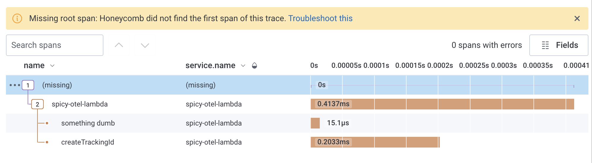

# Why no traces? Traceflags 00 edition

Today we wrote some code, told it to send a trace to Honeycomb, and it didn't. No traces, no error message, why???

This happened to us on AWS Lambda, and it could happen other places too. These debugging techniques can be helpful anywhere you're struggling with OpenTelemetry. Here I'll demonstrate them in a tiny Node app.

Here's the least [code](https://github.com/jessitron/why-no-traces/blob/200630747e2d76ef033d70363a0a7df45583b42b/main.js) that should send a span:

```js
const opentelemetry = require("@opentelemetry/api");

const tracer = opentelemetry.trace.getTracer("jessitron play");
tracer.startSpan("your favorite span").end();
```

But, it doesn't send anything.

## Check the span context to see whether the Trace ID is populated.

One thing I always check is: did the span get a Trace ID at all? I print out its SpanContext. In Node, that looks like [this](https://github.com/jessitron/why-no-traces/blob/ea4aab3c953f57bde99c493feff6cb58e669e4bd/main.js):

```js
const opentelemetry = require("@opentelemetry/api");

const tracer = opentelemetry.trace.getTracer("jessitron play");
const span = tracer.startSpan("your favorite span");
console.log("Span Context: " + JSON.stringify(span.spanContext()));
span.end();
```

This gives me the output:

```txt
Span Context: {"traceId":"00000000000000000000000000000000","spanId":"0000000000000000","traceFlags":0}
```

Look at all those zeros! When the Trace ID is all zeros, that means tracing was not initialized.

Sometimes that means tracing was not initialized _yet_. Now and then it takes it a second - not a problem in web servers, but it can trip you up if you're tracing a Node script.

More often it means that I forgot to bring in my tracing initialization code. In my toy [package.json](https://github.com/jessitron/why-no-traces/blob/1e1f6080a5eb47a4de9c38fd3700aa4cedec01e0/package.json#L7C6-L7C6), I choose to add the require of `tracing.js` because that's where I put the tracing initialization code.

```json
{
  "scripts": {
    "start": "node --require ./tracing.js main.js
  }
}
```

In our AWS Lambda using the [OpenTelemetry Lambda Layer](https://opentelemetry.io/docs/faas/lambda-auto-instrument/) for JavaScript, we had to define the environment variable `AWS_LAMBDA_EXEC_WRAPPER=/opt/otel-handler`. That told Lambda to start the invocation in the layer.

Then we got output like this:

```txt
Span Context: {"traceId":"0da3aa6fe6831e4cc0bf545702195448","spanId":"f726b788cd02eb04","traceFlags":0}
```

It's a real Trace ID! But we still didn't see it in Honeycomb. 😡

## Check the Trace flags to see whether this span was sampled.

First, we [turned on debug logging](https://github.com/jessitron/why-no-traces/blob/c78cb970c4fb2aa1ff81cfb2fb5eb1062c93b7e1/tracing.js#L4) before tracing initialization:

```
const api = require("@opentelemetry/api");

api.diag.setLogger(new api.DiagConsoleLogger(), api.DiagLogLevel.DEBUG);
```

Among many other outputs, we saw `Recording is off, propagating context in a non-recording span`. What! A non-recording span?

Notice that our span context included `traceFlags=0`. This is a bad sign.

```txt
Span Context: {"traceId":"0da3aa6fe6831e4cc0bf545702195448","spanId":"f726b788cd02eb04","traceFlags":0}
```

When `traceFlags` is 0, that means the span is not sampled. That means it's gonna be dropped and not sent to the tracing backend. Bad! How does this happen?

To help troubleshoot this, set `OTEL_TRACES_SAMPLER=always_on`. I found this in [documentation](https://opentelemetry.io/docs/specs/otel/configuration/sdk-environment-variables/) about the OpenTelemetry SDK spec.

The default seems to be `parentbased_always_on`, which means: if the parent span is not sampled, then don't sample this one (keep `traceFlags=0` on child spans). Whenever creating a trace, always sample it (`traceFlags=1`).

Setting `OTEL_TRACES_SAMPLER=always_on` causes child spans to be sampled & sent, even if the parent isn't.

In AWS Lambda, this got our events into Honeycomb. The traces have missing root spans, which makes sense since they were children of a span not sent.



When this happens in your software systems, ask: who is calling my app, and sending a parent span, and choosing to not sample the trace?

Something is passing over the network an [HTTP header](https://www.w3.org/TR/trace-context/#sampled-flag) (or gRPC metadata) with `traceparent` header, and its `traceflags` are set to 0 for "don't bother sending spans, because this whole trace is being dropped."

In the case of AWS Lambda, we couldn't figure out why it was sending this saddening `traceparent` header to our Lambda. We did find that if we put the Lambda behind an API gateway _and_ called it with a good `traceparent` header, then it passed our header through, and we were able to see root spans. Your mileage may vary.

TL;DR: Investigate the SpanContext. All zeros in a Trace ID is bad. Zeros in traceFlags, also bad.
